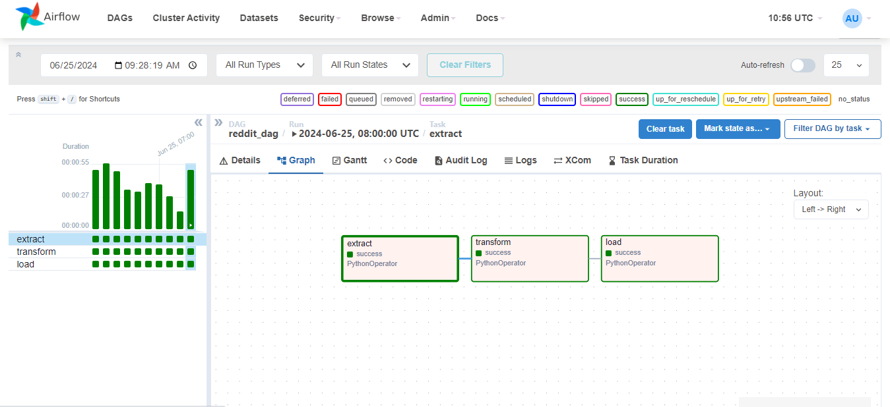

# redit-etl-airflow
redit pipe line using airflow to: 
  
 1- pull trending posts about python from redit api
  
 2- transforming the data and extracting the desired features
  
 3- storing it on aws s3 bucket hourly
 
